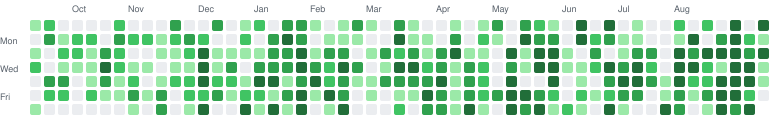

 

---

I work on **AI in physical systems** — the point where a model stops producing text and starts moving something.

That means control and robotics as much as it means machine learning. A policy is only as good as the loop it closes, the sensor feeding it, and the firmware underneath that has to hit its deadline every cycle. I came up through control engineering and embedded systems, and I've stayed there on purpose while the rest of the field moved to the browser.

Right now I'm the **Founding AI & FD Engineer at a stealth agentic startup**, building the systems below in production. Most of what I ship lives in private repos, so the graph is a better picture of what I do than anything I could pin to this profile.

  
   
  Shaded by quartiles of my own active days, so one 179-commit day doesn't wash out the rest.

## AI engineering

**Harness design.** The model is rarely the bottleneck — the harness around it is. I build the layer that turns raw capability into something dependable: context assembly and compaction, tool interfaces, memory that survives a session, verification loops, and the control logic deciding when an agent should retry, stop, or escalate. Hold the model fixed and improve only the harness and task completion moves double digits; that is where most of the real engineering lives.

**Multi-agent systems.** Orchestrating specialists instead of asking one model to do everything — sequential pipelines, parallel fan-out, planner-executor splits, and the routing and shared state that keep agents coherent rather than compounding each other's mistakes.

**Retrieval at scale.** Advanced RAG serving thousands of users: hybrid dense and sparse retrieval fused into a single ranking, query rewriting and decomposition, cross-encoder reranking, graph-backed indexes, chunk-level access control, and answers grounded with citations — plus the eval harnesses that prove a change actually helped instead of just feeling better.

**Fine-tuning and optimization.** Adapting models to a domain when prompting stops paying off, then making them cheap and fast enough to actually run: adapter-based fine-tuning, quantization, distillation, caching, and streaming.

**Realtime.** Systems where latency is a feature rather than a metric — voice and streaming interfaces in which a few hundred milliseconds decides whether something feels alive or broken.

## Control and robotics

ROS, MATLAB and Simulink, dynamic modelling and trajectory planning, state estimation, and firmware in C and C++ down to ESP-IDF on bare boards — BLE, OTA, sensor drivers, the parts that have to be right before anything intelligent can sit on top.

The work I care about most is where the two halves meet: perception and learned policies running on hardware with a power budget, a duty cycle, and no tolerance for a model that hangs.

## What I'm building

**Intuitive Evolution** — *in development.* Sustainable robotics, built on the idea that a robot should do more with less: less material, less energy, fewer parts you can't repair. That constraint drives the mechanical design, the power budget and the control stack, not just the pitch. Our first robot kit is **Alan**, and we open-sourced **[herm](https://github.com/jpalepu/herm_ws)**, the modular v1.0 that got us there. herm is still the most fun thing I've worked on.

On the software side I'm the founder of **[ahsk](https://ahsk.app)** — a voice-first AI assistant for the Mac: dictation under 250 ms, translation across 50+ languages, AI rewriting, all inside whatever app you're already in. I also co-created **[Cverra](https://cverra.com)**, which writes a resume against the actual job description instead of a template.

---

**Open to** collaboration on robotics, control systems, and applied AI that has to run on real hardware.

<a href="mailto:jpalepu@icloud.com">jpalepu@icloud.com</a> · Rome, Italy

<i>"In the midst of chaos, there is also opportunity."</i> — Sun Tzu

